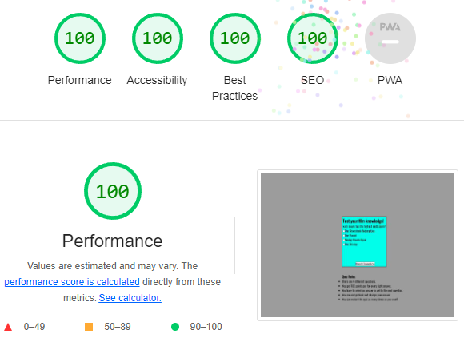

# **The Film Quiz** #
The Film Quiz is a quiz game made to test and expand your film knowledge.
The game is aimed towards anyone who likes film, age does not matter!  
The fully responsive quiz has a grey background color that fits well with the light blue game area color and the black bold text font.

## **Features** ##
 ## Existing features ##
 * ### Header ### 
   * The header, located right above the questions inside the game area, makes the player instantly realise what the quiz is about.
   * The black font matches well with the blue background color.

   

* ### Questions and Answers
  * The Quiz asks the user a question with 4 different answers presented as radio buttons.
  * When an answer is chosen, the user can then click the interactive next question button wich takes the user to the next question and answers.
  * The user must select and answer to be able to click the next question button.

   

* ### Quiz Results
  * When the user has answered all the questions, the javascript code hides the game area and shows the score area.
  * The score area shows how many points you got by checking your total correct answers.
  * You can then press the interactive try again button that resets the quiz.

  

* ### The Footer
  * The footer shows the quiz rules at the bottom of the page.
  * The rules are easy to read and understand and gives the user clear instructions.

   

  ## Features to implement
  * A place where the user can enter their username.
  * A feedback form where the user can submit their feedback. 

  ## Testing
  * The quiz is tested and works on Chrome, firefox, microsoft edge and safari.
  * The quiz is responsive for different screen sizes.
  * The score of the game is always correct and the buttons are always clickable and works.
  * I tested the site using lighthouse with a 100 score in each category.

  

  ## Validator testing
  * ### HTML
    * The W3C validator showed no errors in the code.

  * ### CSS
    * The Jigsaw validator showed no errors in the code. 

  * ### JavaScript
    * JShint Showed no errors in the code.   

  ## Unfixed Bugs
  * When pressing the Try again button at the end of the quiz, the game goes back to question #2 instead of #1.
  * I have yet been able to adress this issue.

  ## Deployment
  * The site was deployed to GitHub pages. The steps to deploy are as follows: 
  * In the GitHub repository, navigate to settings tab.
  * Then click on the pages tab.
  * From the source drop-down menu, select deploy from a branch.
  * From the branch drop-down menu, select main.
  The live link can be found here - https://hannes-h98.github.io/project_2/

  ## Credits
  ### Content
  * https://developer.mozilla.org/en-US/docs/Web/API/Node/appendChild
  * https://developer.mozilla.org/en-US/docs/Web/JavaScript/Reference/Statements/return 
  * https://stackoverflow.com/questions/1950939/creating-input-field-for-html-form-but-adding-a-label-for-it-as-well
  * The above links where used as inspiration for some of the code to the quiz.

  ### Media
  * The favicon was taken from [favicon.io](https://favicon.io/favicon-generator/)
  * The font was taken from [Font Awesome](https://fonts.google.com/variablefonts)

 
